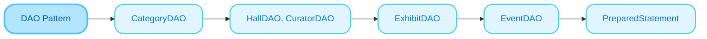
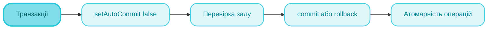

<sup>📒 Readme ver 1.0 28.11.2025 12:00<sup/>


# `Лабораторна робота` `№9` `Робота з базами даних (JDBC)`

[](https://docs.google.com/document/d/1wwj66-vjQPf1GJhMPVXCnMQMlVniYY-g/edit)
[](https://github.com/Soluvent)


[](#)

## `📝 Завдання `
### Система управління музеєм (Варіант 6)
  - [x] Створити реляційну базу даних SQLite з 5 таблицями
  - [x] Реалізувати CRUD-операції для всіх сутностей
  - [x] Реалізувати пошук експонатів за назвою та періодом
  - [x] Реалізувати фільтрацію за залом та категорією
  - [x] Реалізувати сортування за датою надходження
  - [x] Реалізувати транзакції при плануванні подій
  - [x] Використати PreparedStatement для захисту від SQL-ін'єкцій

## `🧠 Mindmap `





## `🛠️ Реалізація коду `

## Конфігурація Maven (pom.xml)

### **Налаштування проєкту**
> [!NOTE]
> Проєкт використовує Java 17 та Maven. Додано залежність SQLite JDBC 3.45.1.0 для роботи з вбудованою базою даних.

<h4 align="wide">

```xml
<?xml version="1.0" encoding="UTF-8"?>
<project xmlns="http://maven.apache.org/POM/4.0.0">
    <modelVersion>4.0.0</modelVersion>
    <groupId>ua.edu.opu</groupId>
    <artifactId>museum-system</artifactId>
    <version>1.0</version>

    <properties>
        <maven.compiler.source>17</maven.compiler.source>
        <maven.compiler.target>17</maven.compiler.target>
    </properties>

    <dependencies>
        <dependency>
            <groupId>org.xerial</groupId>
            <artifactId>sqlite-jdbc</artifactId>
            <version>3.45.1.0</version>
        </dependency>
    </dependencies>
</project>
```

</h4>

## DBUtil.java - Підключення до бази даних

### **Ініціалізація драйвера та з'єднання**
> [!NOTE]
> Клас DBUtil забезпечує централізоване управління з'єднаннями. Статичний блок завантажує драйвер SQLite, а метод getConnection() активує підтримку зовнішніх ключів.

<h4 align="wide">

```java
public class DBUtil {
    private static final String URL = "jdbc:sqlite:museum.db";

    static {
        try {
            Class.forName("org.sqlite.JDBC");
        } catch (ClassNotFoundException e) {
            System.err.println("SQLite JDBC драйвер не знайдено!");
        }
    }

    public static Connection getConnection() throws SQLException {
        Connection conn = DriverManager.getConnection(URL);
        try (Statement st = conn.createStatement()) {
            st.execute("PRAGMA foreign_keys = ON");
        }
        return conn;
    }
}
```

</h4>

## ExhibitDAO.java - Пошук з фільтрацією

### **Динамічна побудова SQL-запиту**
> [!NOTE]
> Метод findAll() демонструє динамічну побудову SQL із підтримкою пошуку (LIKE), фільтрації (WHERE) та сортування (ORDER BY). PreparedStatement захищає від SQL-ін'єкцій.

<h4 align="wide">

```java
public List<Exhibit> findAll(String nameLike, Integer hallId, 
                              String sortBy, boolean asc) throws SQLException {
    StringBuilder sb = new StringBuilder(
        "SELECT e.*, c.name as cat_name, h.name as hall_name " +
        "FROM exhibits e " +
        "LEFT JOIN categories c ON e.category_id = c.id " +
        "LEFT JOIN halls h ON e.hall_id = h.id WHERE 1=1");
    List<Object> params = new ArrayList<>();
    
    if (nameLike != null && !nameLike.isEmpty()) {
        sb.append(" AND e.name LIKE ?");
        params.add("%" + nameLike + "%");
    }
    if (hallId != null) {
        sb.append(" AND e.hall_id = ?");
        params.add(hallId);
    }
    sb.append(" ORDER BY ").append(orderField)
      .append(asc ? " ASC" : " DESC");
    
    // Виконання з PreparedStatement...
}
```

</h4>

## EventDAO.java - Транзакції

### **Атомарність операцій**
> [!NOTE]
> Метод createWithValidation() демонструє використання транзакцій: setAutoCommit(false) для групування операцій, перевірка доступності залу, commit() при успіху або rollback() при помилці.

<h4 align="wide">

```java
public Event createWithValidation(Event e) throws SQLException {
    Connection conn = null;
    try {
        conn = DBUtil.getConnection();
        conn.setAutoCommit(false);  // Початок транзакції
        
        // Перевірка доступності залу
        String checkSql = "SELECT COUNT(*) FROM events " +
                          "WHERE hall_id = ? AND event_date = ?";
        try (PreparedStatement ps = conn.prepareStatement(checkSql)) {
            ps.setInt(1, e.getHallId());
            ps.setString(2, e.getEventDate());
            try (ResultSet rs = ps.executeQuery()) {
                if (rs.next() && rs.getInt(1) > 0) {
                    throw new SQLException("Зал вже зайнятий!");
                }
            }
        }
        
        // INSERT та commit...
        conn.commit();
        return e;
    } catch (SQLException ex) {
        if (conn != null) conn.rollback();
        throw ex;
    }
}
```

</h4>

> [!IMPORTANT]
> **Ключові особливості реалізації:**
> - PreparedStatement для безпеки
> - Динамічні SQL-запити через StringBuilder
> - Транзакції для атомарності
> - JOIN для отримання пов'язаних даних
> - try-with-resources для управління ресурсами

## `📊 Структура бази даних `

```
┌─────────────┐    ┌─────────────┐    ┌─────────────┐
│ categories  │    │    halls    │    │  curators   │
├─────────────┤    ├─────────────┤    ├─────────────┤
│ id (PK)     │    │ id (PK)     │    │ id (PK)     │
│ name        │    │ name        │    │ name        │
│ description │    │ floor       │    │ email       │
└──────┬──────┘    │ capacity    │    │ phone       │
       │           └──────┬──────┘    │ specializati│
       │                  │           └──────┬──────┘
       │    ┌─────────────┴─────────────┐    │
       └────┤        exhibits           ├────┘
            ├───────────────────────────┤
            │ id (PK)                   │
            │ name, description         │
            │ creation_period           │
            │ arrival_date              │
            │ category_id (FK)          │
            │ hall_id (FK)              │
            │ curator_id (FK)           │
            └───────────────────────────┘
                        
            ┌───────────────────────────┐
            │         events            │
            ├───────────────────────────┤
            │ id, name, event_type      │
            │ event_date, max_visitors  │
            │ hall_id (FK)              │
            │ curator_id (FK)           │
            └───────────────────────────┘
```

## `📊 Результати виконання `

### Консольний вивід

```
===========================================
  СИСТЕМА УПРАВЛІННЯ МУЗЕЄМ
===========================================

--- ГОЛОВНЕ МЕНЮ ---
1. Управління експонатами
2. Управління подіями
3. Управління категоріями
4. Управління залами
5. Управління кураторами
6. Додати тестові дані
0. Вихід
Ваш вибір: 6

Додавання тестових даних...
Тестові дані успішно додано!

--- Список експонатів ---
1. Амфора грецька | V ст. до н.е. | Археологія | Античний зал
2. Сонячний ранок | XIX століття | Живопис | Зал імпресіоністів
3. Бронзова статуя воїна | II ст. н.е. | Скульптура | Зал скульптури
```

### Структура проєкту

```
lab9_museum/
├── pom.xml
├── src/main/java/
│   ├── DBUtil.java
│   ├── Category.java / CategoryDAO.java
│   ├── Hall.java / HallDAO.java
│   ├── Curator.java / CuratorDAO.java
│   ├── Exhibit.java / ExhibitDAO.java
│   ├── Event.java / EventDAO.java
│   └── Main.java
└── museum.db (створюється автоматично)
```
